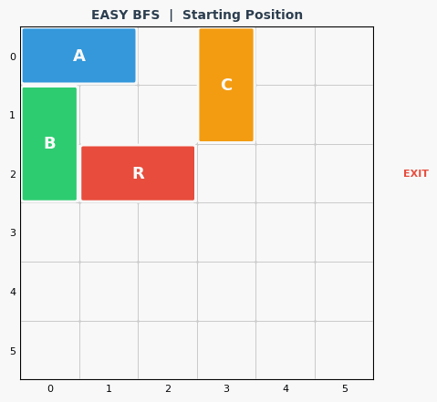
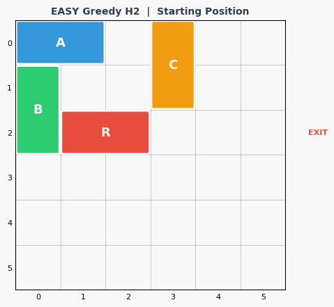
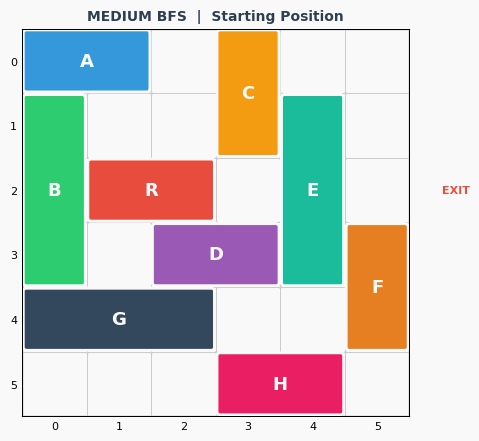
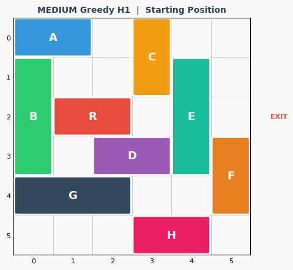
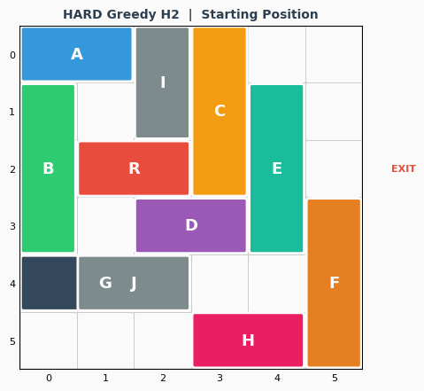
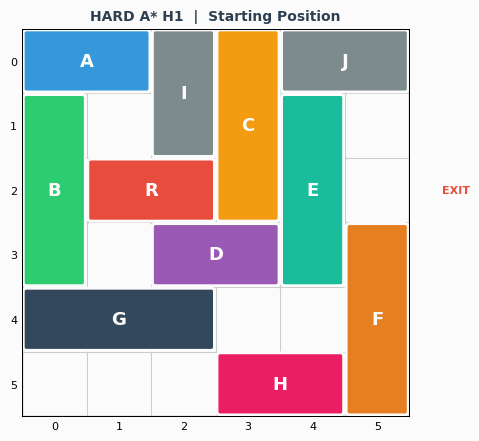
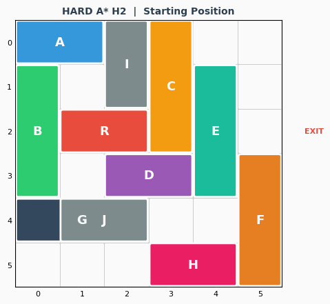

# Rush Hour Puzzle Solver  
**Group 15 | CSF401 Artificial Intelligence | BITS Pilani**  
**Semester 2, 2025-26 | Complexity Level: L2**   
**Members : Shivansh Saxena, Navya Jain, Aditya Kumar Panda** 

## How To Run

Install dependencies:
 pip install matplotlib numpy pillow

Run the solver:
 python rush_hour.py

Outfit GIFs will be saved in the output/folder.
Set SHOW_SEARCH = False to save gifs of the final output.

## Algorithm Used

**BFS(Breadth First Search)**
Explore all states level by level. Guaranteed to find the shortest solution. Does not use any heurestic.

**IDDFS(Iterative Deepening DFS)**
Runs DFS with increasing depth limits. Uses much less memory than BFS while still finding the optimal solution.

**Greedy Best First Search**
Always picks the state that looks closest to the goal using the heurestic. Fast but not guaranteed to be optimal.

**A*Search**
Combines actual move cost g(n) and heurestic h(n) using
f(n) = g(n) + h(n)
Optimal and efficient. 

## Heuristics
**H1-Blocking Vehicle Count**
Counts how many vehicles are sitting between the red car and the exit.Each needs at least one move to clear.
Admissible-never overestimates the true remaining cost.

**H2-Blocking Count + Distance**
Takes H1 and adds the remaining distance the red car must travel.Tighter estimate,still admissible .
H2 dominates H1 so A* with H2 explores fewer states .

##  Puzzle Levels
| Level | Vehicles | Description |
|-------|----------|-------------|
| Easy | 4 | Simple board, few blockers |
| Medium | 9 | L2 complexity, multiple blockers |
| Hard | 11 | Dense board, increased difficulty |

##  Results

### Easy Level
| Algorithm | Heuristic | Moves | States Explored |
|-----------|-----------|-------|-----------------|
| BFS | None | 3 | 15 |
| IDDFS | None | 3 | 60 |
| Greedy | H1 | 3 | 11 |
| Greedy | H2 | 3 | 4 |
| A* | H1 | 3 | 15 |
| A* | H2 | 3 | 4 |

### Medium Level
| Algorithm | Heuristic | Moves | States Explored |
|-----------|-----------|-------|-----------------|
| BFS | None | 6 | 1939 |
| IDDFS | None | 8 | 360 |
| Greedy | H1 | 6 | 63 |
| Greedy | H2 | 6 | 31 |
| A* | H1 | 6 | 1039 |
| A* | H2 | 6 | 85 |

### Hard Level
| Algorithm | Heuristic | Moves | States Explored |
|-----------|-----------|-------|-----------------|
| BFS | None | 11 | 3111 |
| IDDFS | None | 15 | 1200 |
| Greedy | H1 | 11 | 50 |
| Greedy | H2 | 11 | 48 |
| A* | H1 | 11 | 2099 |
| A* | H2 | 11 | 696 |

**Same moves** = all found the optimal solution.  
**Fewer states** = smarter and more efficient search.  
 A* with H2 explores the fewest states overall.  

##  Easy Level Solutions

| Algorithm | Solution |
|-----------|----------|
| BFS |  |
| IDDFS |  |
| Greedy H1 |  |
| Greedy H2 |  |
| A* H1 |  |
| A* H2 |  |

---

## Medium Level Solutions

| Algorithm | Solution |
|-----------|----------|
| BFS |  |
| IDDFS |  |
| Greedy H1 |  |
| Greedy H2 |  |
| A* H1 |  |
| A* H2 |  |

---

##  Hard Level Solutions

| Algorithm | Solution |
|-----------|----------|
| BFS |  |
| IDDFS |  |
| Greedy H1 |  |
| Greedy H2 |  |
| A* H1 |  |
| A* H2 |  |

## References

[1] S. Russell and P. Norvig, Artificial Intelligence: A Modern Approach, 3rd ed. Pearson, 2010.

[2] V. Bulitko, Heuristic search for AI pathfinding, University of Alberta, 2011.

[3] R. Korf, Iterative-deepening A*: An optimal admissible tree search,Artificial Intelligence, vol. 27, no. 1, pp. 97-109, 1985.
